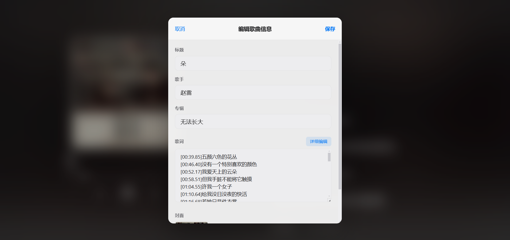
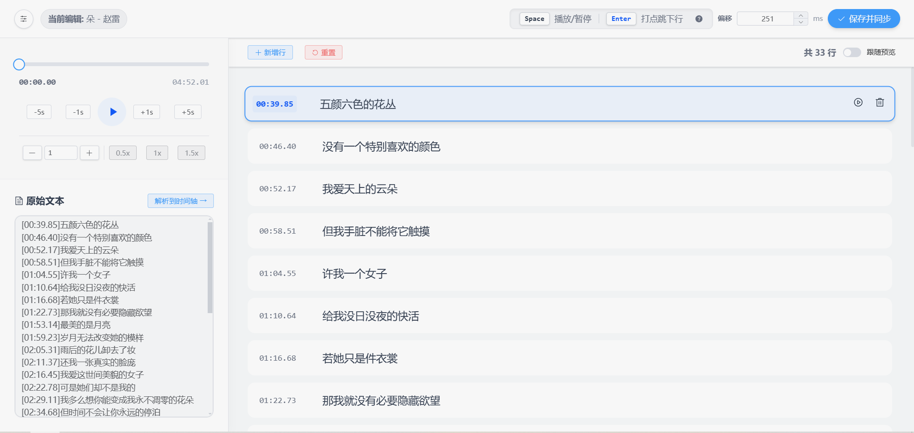
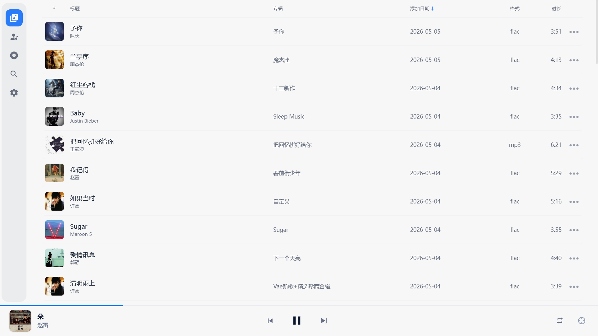
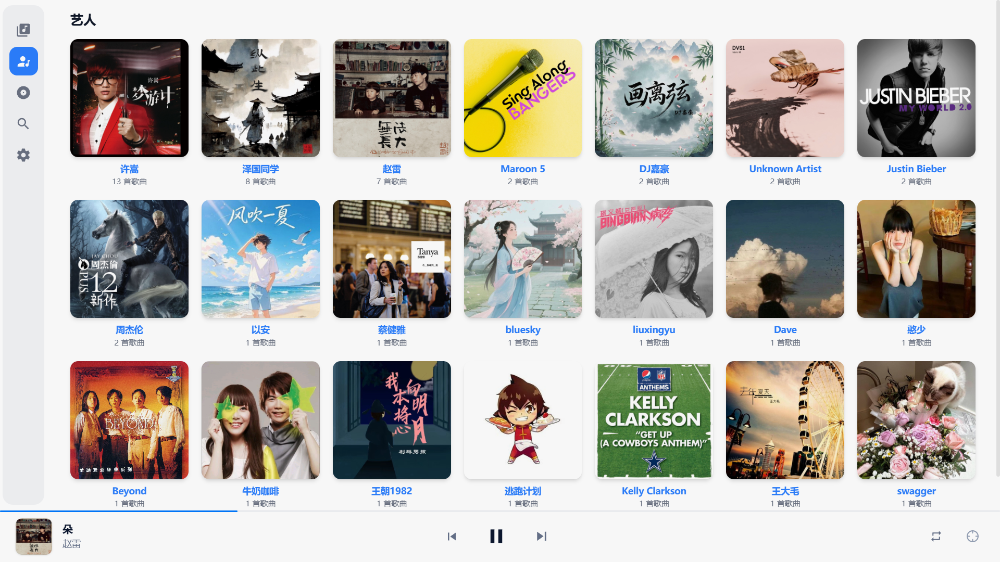
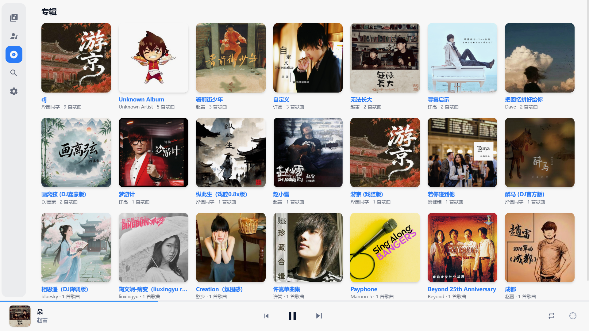
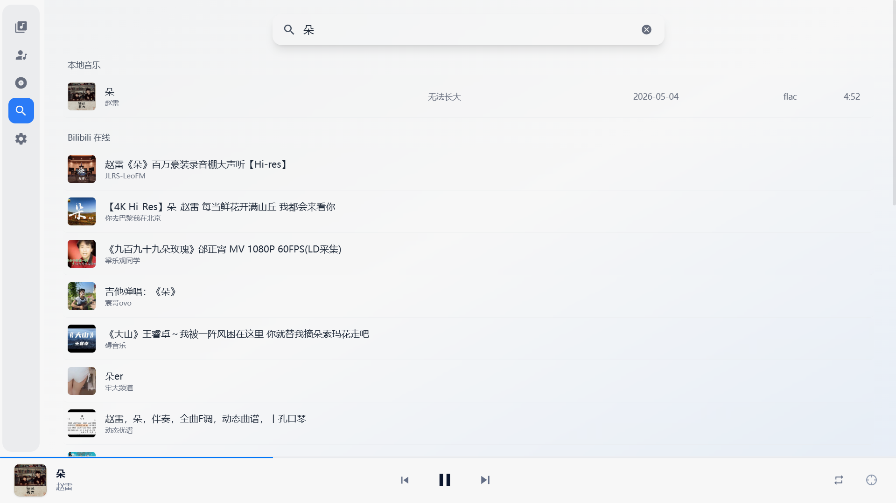
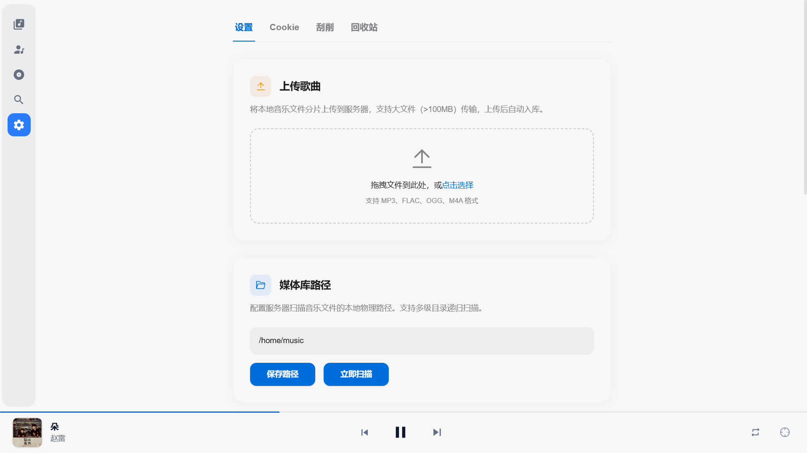
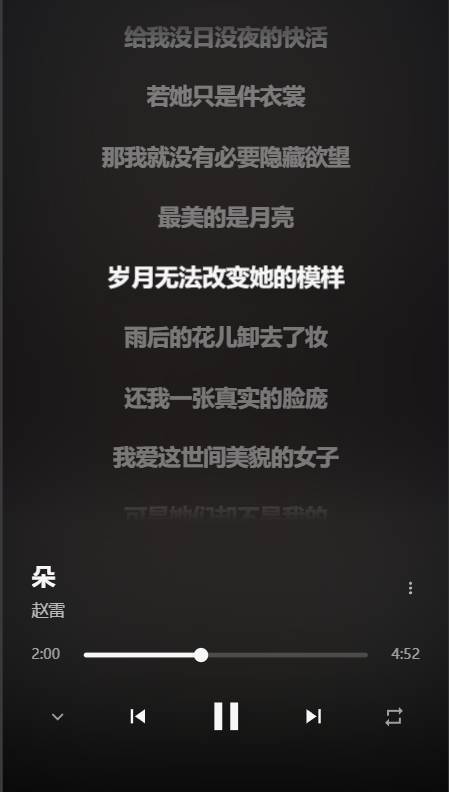
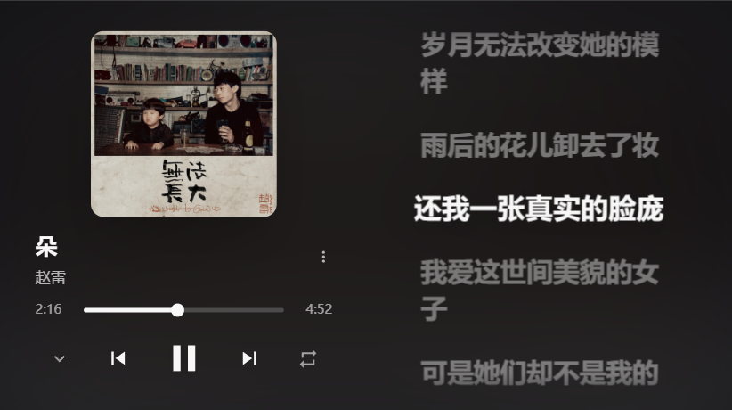

# NasMusic-Ai

基于 Django + Vue 3 + Gemini 构建的现代化本地音乐库管理系统。支持音乐扫描入库、多歌手智能拆分、流媒体播放、封面歌词刮削、分片上传、回收站、音乐信息编辑、LRC歌词时间轴打点等功能，提供完整的 RESTful API，可配合 Nginx 部署为高效流媒体服务。

---

## 项目截图












---

## 功能特性

- **音乐扫描入库**：自动扫描本地音乐文件夹，读取音频文件标签（ID3、Vorbis）并提取封面
- **标签同步**：修改歌曲信息后自动同步写入物理音频文件的 ID3/Vorbis 标签
- **回收站功能**：删除的文件自动移入 `.trash` 目录，支持恢复和彻底删除
- **封面/歌词刮削**：支持从网络自动刮削歌曲封面和歌词（单首/批量）
- **音乐信息编辑**：支持在线编辑歌曲标题、歌手、专辑、歌词、封面等信息
- **歌词时间轴打点**：支持键盘快捷键（Space播放/暂停、Enter打点跳下行）精确定位歌词时间轴，可视化编辑 LRC 歌词并同步写入音频文件

---

## 项目结构

```
NasMusic/
├── backend/
│   ├── NasMusic/         # Django 项目配置
│   ├── library/          # 核心音乐库管理
│   ├── scanner/          # 音乐扫描入库
│   ├── stream/           # 音频流媒体服务
│   ├── scraper/          # 音乐信息刮削器
│   ├── frontned/         # Vue 前端项目
│   ├── manage.py         # Django 管理脚本
│   └── requirements.txt   # Python 依赖
-------------------
```

---

## 快速开始

### 1. 创建虚拟环境

```bash
python -m venv .venv
.venv\Scripts\activate
```

### 2. 安装依赖

```bash
pip install -r requirements.txt
```

### 3. 数据库迁移

```bash
python manage.py makemigrations
python manage.py migrate
```

### 4. 创建超级用户

```bash
python manage.py createsuperuser
```

### 5. 启动服务

```bash
python manage.py runserver
```

### 6. 扫描音乐库

```
在设置页面填入音乐库路径，点击扫描按钮即可开始扫描。
```


---

## Nginx 部署配置

生产环境推荐使用 Nginx 作为反向代理，配合 Django 的 X-Accel-Redirect 实现高效音频流媒体服务。

```nginx
server {
    listen 80;
    server_name 10.0.0.8;

    # 1. 优先处理前端静态文件
    location / {
        root /www/wwwroot/frontned; # 确认是你前端 dist 的路径
        index index.html;
        try_files $uri $uri/ /index.html; # 支持 Vue/React 路由
    }

    # 2. 转发 API 请求到后端 8000 端口[cite: 1]
    location /api/ {
        proxy_pass http://127.0.0.1:8000; 
        proxy_set_header Host $host;
        proxy_set_header X-Real-IP $remote_addr;
        proxy_set_header X-Forwarded-For $proxy_add_x_forwarded_for;
        proxy_set_header X-Forwarded-Proto $scheme;
    }
    
    # 新增：处理 Django 后台管理界面
    location /admin/ {
        proxy_pass http://127.0.0.1:8000; 
        proxy_set_header Host $host;
        proxy_set_header X-Real-IP $remote_addr;
        proxy_set_header X-Forwarded-For $proxy_add_x_forwarded_for;
        proxy_set_header X-Forwarded-Proto $scheme;
    }
    
    # 新增：处理不带 api 前缀的音频流请求
    location /stream/ {
        proxy_pass http://127.0.0.1:8000; # 转发给 Django 后端
        proxy_set_header Host $host;
        proxy_set_header X-Real-IP $remote_addr;
        proxy_set_header X-Forwarded-For $proxy_add_x_forwarded_for;
        proxy_set_header X-Forwarded-Proto $scheme;
        
        # 必须加上这两行，防止 Nginx 缓存音频流导致播放卡顿
        proxy_buffering off;
        proxy_cache off;
    }

    # 3. 后台管理界面和静态资源
    location /static/ {
        alias /www/wwwroot/NasMusic/static_root/; # 替换为后端收集后的静态路径[cite: 1]
    }
    location /media/ {
        alias /www/wwwroot/NasMusic/media/; # 替换为后端封面图路径[cite: 1]
    }

    # 4. 高性能流媒体通道 (X-Accel-Redirect)[cite: 1, 3]
    location /protected_music/ {
        internal; # 外部无法直接访问
        alias /home/music/; # 替换为你音乐库的真实绝对路径
        sendfile on;
        tcp_nopush on;
        default_type audio/mpeg;
        add_header Accept-Ranges bytes;
        # 【补丁2】防止 Nginx 接管后丢失跨域头，导致前端播放器静默拦截
        add_header Access-Control-Allow-Origin *;
    }
}
```


## 技术栈

- **后端**：Django 6 + Django REST Framework
- **数据库**：SQLite（默认）/ PostgreSQL
- **音频处理**：mutagen
- **图片处理**：Pillow
- **前端**：Vue 3

---

## 许可证

MIT License
